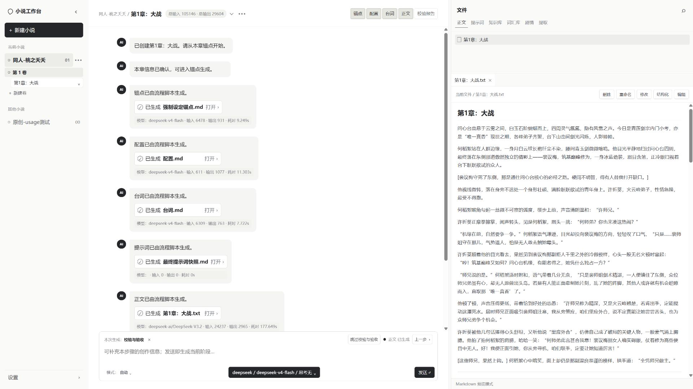
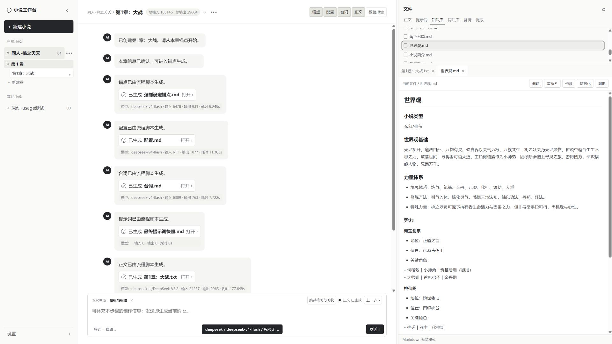
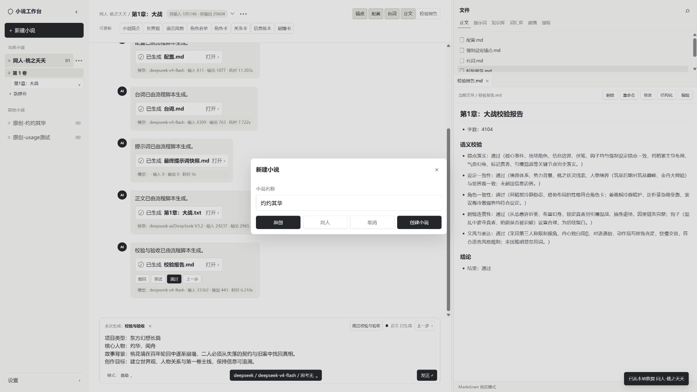
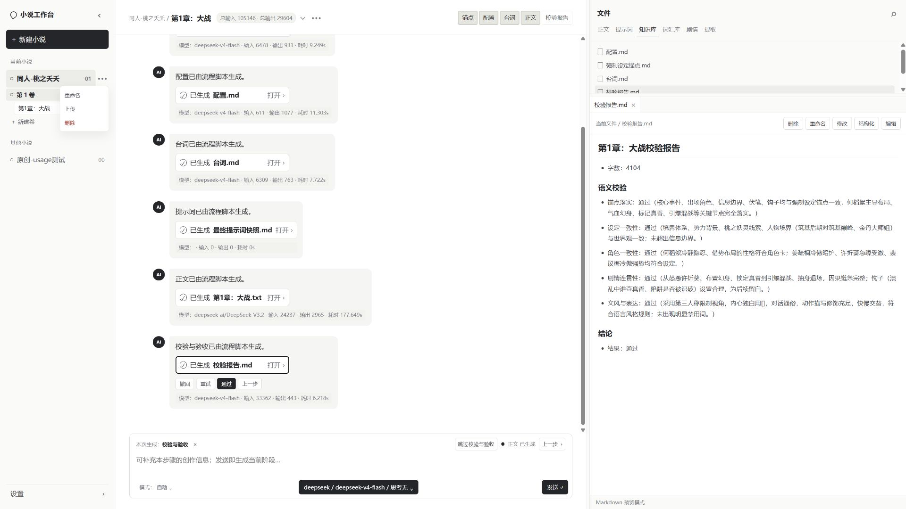
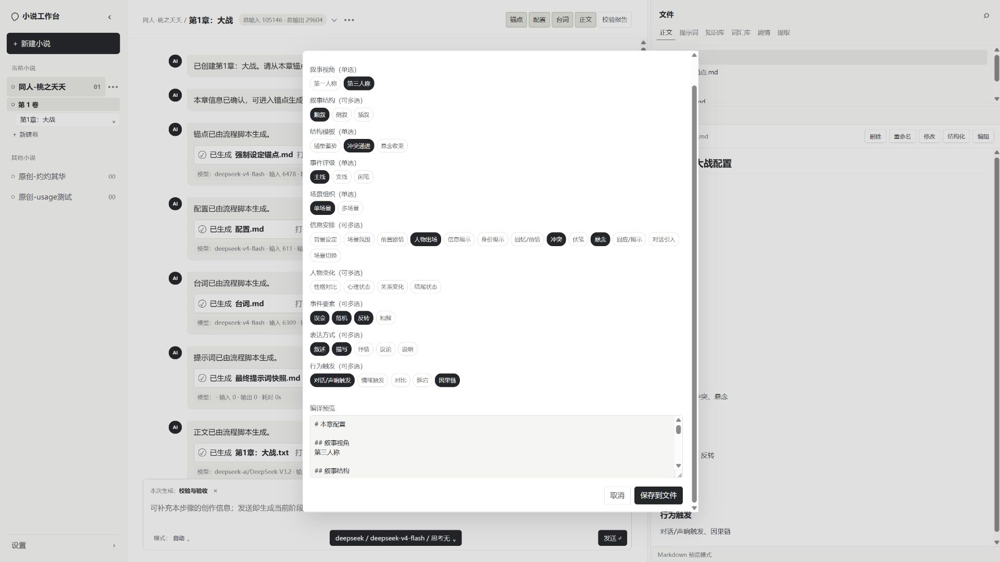

# 文脉工作台 (Wenmai Workbench)

<p align="center">
  
</p>

一个面向长篇小说作者的**本地 AI 创作工作台**：把初始化资料、世界观、角色卡、剧情、章节正文和校验报告组织成可追溯的本地项目，并用 LLM 按步骤生成正式资产。AI 能力被放入一套步骤化的创作流程——先沉淀设定，再按明确节点生成章节，全程可检查、可撤回、可重试。

- 在线仓库：[GitHub · Boundless-Fang/novel-workbench](https://github.com/Boundless-Fang/novel-workbench)
- 完整案例：见 `portfolio/文脉工作台-完整作品展示.html`

## 为什么做这个

长篇小说创作需要跨数十至数百章持续维护世界规则、角色状态、剧情伏笔和语言风格。通用对话式 AI 擅长单次生成，但设定与过程散落在长对话里，复用困难、错误难定位、生成失败难恢复、正式内容不便编辑。

文脉工作台的解法：**设定沉淀为可读写文件 → 上下文在生成前冻结 → 生成后集中校验**，作者保留最终确认权。

## 完整流程

### 三栏工作台

布局仿 Codex / ZCode 等 coding agent 的工作区：**左边项目、中间工作台、右边文件**。

- **左栏 · 项目导航**：当前小说、卷、章节列表，其他小说一键切换
- **中栏 · 流程工作台**：对话式推进每个步骤，产物卡片显示模型、token、耗时，支持撤回 / 重试 / 通过
- **右栏 · 文件面板**：正文 / 提示词 / 知识库 / 词汇库 / 剧情 / 提取 六类文件即时查看与编辑（删除、重命名、修改、结构化、编辑）

### 路线一：原创

```text
新建项目 → 填写简介与资料 → 初始化九件套
（小说简介、世界观、语言风格、角色名单、角色卡、关系卡、剧情书、剧情卷、信息账本）
→ 章节流程（锚点 → 配置 → 台词 → 最终提示词快照 → 正文 → 校验与验收）
→ 顶部「可更新」持续维护全局资产
```

### 路线二：同人（多一步五步提取）

```text
上传原著 txt → 五步提取：
① 原文统计（本地） → ② 高频词（本地） → ③ 原文风格（LLM）
→ ④ 正向词库（LLM + RAG） → ⑤ 专属词库（LLM + RAG，索引缺失自动构建）
→ 提取产物沉淀为词汇库与文风设定 → 初始化时继承原著特征 → 章节流程同原创
```

### 原创 vs 同人，差在哪

| | 原创 | 同人 |
|---|---|---|
| 起点资料 | 角色、背景、剧情梗概 | 原著全文（txt 上传） |
| 文风来源 | 由资料生成「语言风格」资产 | 从原著提取「原文风格」 |
| 专属词汇 | 无 | 正向词库 + 专属词库，专有名词不穿帮 |
| 检索增强 | 无 | bge-m3 向量索引，长原著按需召回 |
| 适用场景 | 从零开始的新故事 | 衍生创作、原著续写 |

## 界面预览

| 知识库（世界观） | 新建小说 |
|---|---|
|  |  |
| 单章生成与校验报告 | 结构化配置 |
|  |  |

## 功能特性

- **原创 / 同人项目**：本地文件存储；同人支持原著上传与五步特征提取。
- **初始化流程**：小说简介、世界观、语言风格、角色名单、角色卡、关系卡、剧情书、剧情卷、信息账本。
- **章节流程**：锚点 → 配置 → 台词 → 最终提示词快照 → 正文 → 校验与验收。正文生成前冻结完整上下文，生成后集中校验，减少设定遗漏和角色失真。
- **全局资产一键更新**：顶部「可更新」区支持世界观、角色卡、关系卡等批量生成/更新。
- **过程可控**：撤回 / 重试 / 下一步；失败卡片显示模型、token、耗时，校验类失败明确标注「校验未通过」。
- **自动模式**：初始化与章节流程可自动连续执行。
- **用量统计**：项目累计输入/输出 token 用量统计与持久化。

## 快速开始

### 1. 环境要求

- Node.js（建议 18+）
- Python 3.11 或 3.12
- 一个 OpenAI 兼容的 LLM API（DeepSeek、硅基流动、OpenAI、Kimi、GLM 等）

### 2. 启动服务

#### 一键启动（推荐）

Windows 双击：

```text
启动工作台.bat
```

macOS / Linux / Git Bash：

```bash
./启动工作台.sh
```

启动器会自动打开浏览器：`http://127.0.0.1:4173`

#### 手动启动

```bash
cd web
node server.mjs
```

### 3. 配置模型

在页面左下角「设置」中填写提供方、API 地址、API Key 和模型，或在顶部模型控件中快速切换。配置保存在 `工作流脚本/工作台设置.json`。

### 默认模型配置

| 步骤 | 提供方 | 模型 | 思考强度 |
| --- | --- | --- | --- |
| 除正文/改写外的所有步骤 | DeepSeek 官方 API | `deepseek-v4-flash` | 低 |
| 正文与改写 | 硅基流动 | `deepseek-ai/DeepSeek-V3.2` | 不思考 |

## 使用流程

1. 新建小说（原创或同人）。
2. 填写小说资料并完成初始化。
3. 新建章节，按步骤生成正文。
4. 校验与验收。
5. 使用顶部「可更新」随时更新全局资产。

## 目录结构

```text
wenmai-workbench/
├─ README.md             # 本文件
├─ docs/                 # PRD、技术文档、作品展示文案
├─ portfolio/            # 作品集素材：截图、封面、作品展示页
├─ web/                  # 前端 + Node 本地服务（方案B：单体服务）
├─ 工作流脚本/            # Python 工作流引擎与步骤模块
└─ 小说项目/              # 所有本地小说项目（运行时数据）
```

详细文件职责见 [docs/技术文档.md](docs/技术文档.md)。

## 测试

统一入口：

```bash
python 工作流脚本/运行测试.py                  # 全部套件（单元+流程+服务端+前端+验收）
python 工作流脚本/运行测试.py --suite 单元     # 后端单元测试（无服务、无模型）
python 工作流脚本/运行测试.py --suite 流程     # 无模型引擎全流程
python 工作流脚本/运行测试.py --suite 服务端   # REST 接口黑盒测试
python 工作流脚本/运行测试.py --suite 前端     # 前端契约静态检查
python 工作流脚本/运行测试.py --suite 验收     # 端到端验收（27 项）
```

真实模型验收（会消耗 API 额度）：`python 工作流脚本/运行测试.py --suite 验收 --live-model`

## 文档

- [产品需求文档](docs/产品需求文档.md)
- [技术文档](docs/技术文档.md)
- [作品展示文案](docs/小说工作台-作品展示文案.md)
- [完整作品展示页](portfolio/文脉工作台-完整作品展示.html)

## 注意事项

- 同人提取的原著请使用自己创作或公有领域（如《西游记》）的作品，版权责任自负。
- `工作台设置.json` 中可能包含 API Key，请勿提交到公开仓库。
- 每个小说项目是普通文件夹，建议用 Git 管理版本。
- 当前版本尚未实现「验收后资产增量更新」和 Git 自动提交。
